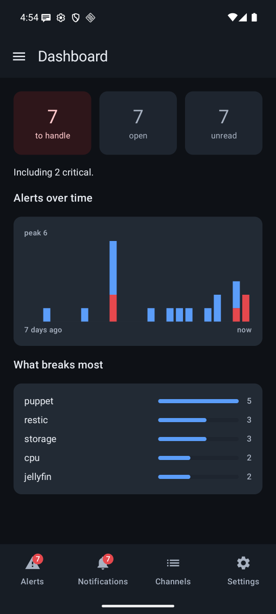
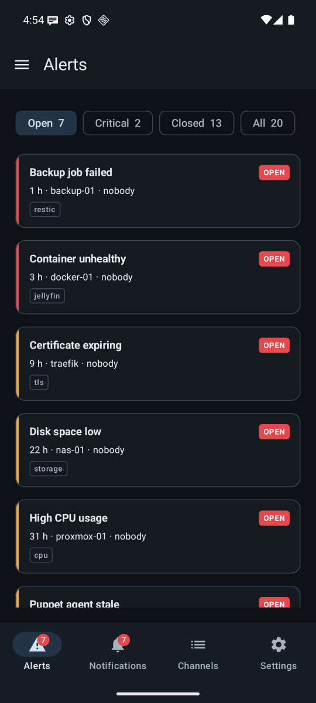
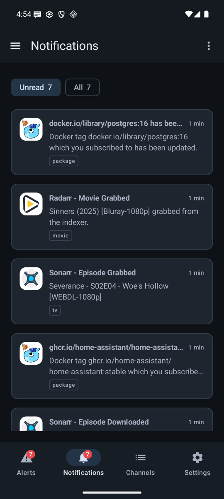

# Home Genie

**A self-hosted alert console and notification feed for a homelab — one server, one
Android application, no third party in the path.**

Alertmanager posts straight to it. Everything already speaking ntfy keeps working by
changing a URL. Nothing passes through Firebase, and nothing needs a bridge process.

| Dashboard | Alerts | Notifications |
|---|---|---|
|  |  |  |

## Why it exists

The setup it replaces was an ntfy paired with an `ntfy-alertmanager` bridge. It worked,
and it had two problems that no amount of configuration would fix.

**An alert was just another message.** It arrived, it scrolled past, and that was the
end of it. There was no way to say "I have seen this, stop reminding me", no way to know
whether anyone had, and no record of what had happened to it. A disk filling up and a
film finishing downloading were the same kind of object.

**There was a bridge in the middle.** A second process to install, configure, keep
running and debug, whose only job was to translate one format into another.

Home Genie removes both. Alerts are a first-class object with a lifecycle, and the two
formats are understood natively — by the same server, on the same port.

## Two ingests, no bridge

### Alertmanager, natively

The v4 webhook posts straight in. Alerts are deduplicated on their `fingerprint`, so one
re-delivered forty times stays one alert with forty occurrences counted — not forty
lines in the shade.

```yaml
receivers:
  - name: home-genie
    webhook_configs:
      - url: https://alerts.example.net/api/v1/ingest/alertmanager/alerts
        http_config:
          authorization: { type: Bearer, credentials: "<publish token>" }
```

Acknowledgement is **local**: nothing is written back to Alertmanager, so the usual
dashboards keep showing what is firing and the phone never writes into the chain it is
watching. What stops is the reminders, and the acknowledgement carries the name of
whoever took it.

### ntfy, as it already is

The publish format is understood as it comes: the `Title`, `Priority`, `Tags` and
`Click` headers, the JSON body, and the query-string form — which is the one the *arr
suite actually sends, and the one an ntfy-compatible server is easy to forget.

Migrating a producer is a URL and a token:

```diff
- url: https://ntfy.example.net/homelab
+ url: https://alerts.example.net/notifications
```

Nothing else in Sonarr, Radarr, diun or a shell script has to change. Markdown in a
body — which diun sends and ntfy never rendered — is understood: bold reads as bold, and
the link diun buries in its sentence becomes a button.

## Alerts and notifications are two different objects

Mixing them forces each to borrow the other's vocabulary, so they are kept apart.

| | Alerts | Notifications |
|---|---|---|
| **Comes from** | Alertmanager, an Icinga bridge | the media tools, an image watcher, a script |
| **Lifecycle** | opens, is taken, reminds, closes | arrives, is read |
| **Read state** | shared — one person takes it for everyone | personal — yours changes nothing for the others |
| **Reminds** | yes, at a cadence per severity | never |

The alert console tells you what is open, who has taken it, and what has been quiet all
week. The feed is a list to be emptied — a full swipe left marks one read, and a tap
opens it, because these carry links and bodies too long for a list.

## What else is in it

**Every producer wears its own face.** A publish token is one per software, so it *is*
the producer's identity: give it the Sonarr logo and every notification Sonarr sends
arrives wearing it. Upload one from the application; it is stored on your server, served
by your server, and nothing is fetched from anywhere else.

**Silence, in two flavours that are not the same thing.**

| | Effect | Scope | What is lost |
|---|---|---|---|
| **Quiet hours** | the notification arrives without noise | global, overridable per channel and per severity | nothing — a reminder comes back when the window closes |
| **Mute** | no notification at all | yours alone, every channel, bounded in time | the notifications of that period |

A quiet window that does not name a severity **never** covers a critical alert.
Silencing one is legitimate on a homelab — a disk filling up at three in the morning can
wait until seven — but it is asked for by naming `critical`, not inherited from a
setting meant for downloads.

A mute goes above everything, criticals included, but it silences only the person who
sets it: "be quiet, I am the one making the noise". The other members keep being
notified and do not even see that somebody went quiet.

**Channels and rights.** A channel carries members (read, publish, administer), publish
tokens — one per producer, revocable without touching the others — and its own reminder
cadences.

**It tells you when it cannot do its job.** The dashboard raises a warning only when a
system setting is genuinely missing: battery optimisation exemption, notification
permission, Do Not Disturb access. When everything is in order, it says nothing — and
when a socket is down it says so, because the absence of alerts otherwise looks exactly
like calm.

## How it works

```
Alertmanager ─┐
media tools  ─┼─→ hgenied ──WebSocket──→ Android application
scripts      ─┘      │
                     └─ SQLite (state, history, hashed tokens)
```

The phone keeps an **open socket** in a foreground service. Every event carries a
monotonic sequence number; on reconnection the client asks for what follows the last
number it received, so an outage costs time, never a message. An application heartbeat
crosses the socket in both directions: the server knows a device is still listening,
which an open TCP socket does not prove.

No FCM. Notifications pass through no third party, and the server does not need to be
reachable from the outside to emit them.

## Installing

### Server

A Debian package for `amd64` and `arm64`, published in the GitHub releases. It
installs `hgenied`, its systemd unit and its system user.

```sh
dpkg -i home-genie_<version>_arm64.deb
$EDITOR /etc/home-genie/config.yaml
systemctl enable --now home-genie
```

The configuration fits in a few lines — see [`config.example.yaml`](config.example.yaml).
The service listens in cleartext: put it behind a reverse proxy that terminates TLS
and knows how to relay a WebSocket.

Create the first account, the **break-glass** one, the account that works when the
identity provider no longer answers:

```sh
hgenied admin create -config /etc/home-genie/config.yaml -username <name>
```

### Application

The APK is published with each release. It installs by sideload: on first launch, give
the server URL, then sign in — with the break-glass account, or through OIDC if one is
configured.

## Authentication

Two paths, for two situations:

- **OIDC** (Authorization Code + PKCE, public client) — the normal path. The
  application opens a Custom Tab, gets an ID token back, and the server verifies it
  against the provider's JWKS. No client secret is embedded in the APK, because a
  native application cannot keep one.
- **Local account** — the break-glass door, protected by argon2id. It exists for the
  day the identity provider is down, which is exactly the day the alerts matter.

In both cases the application receives a **device token** of its own. The server stores
only its SHA-256 fingerprint; the cleartext token appears once.

## Decisions, and why

**A WebSocket, not FCM.** The risk of this project is not the network, it is Android's
battery arbitration. A night of continuous observation settled it: the socket held for
7 h 56 without interruption under a vendor Android skin. FCM stays a way out if the
figures degrade, not a prerequisite.

**Two channels are enough.** Splitting `alerts-critical` / `alerts-warning` re-encodes
in the channel what the alert already carries — its `severity` label — and everything
that could use it already relies on the severity. What a channel really separates is
**who can read**, **what a token may publish**, and **what can be silenced**.

**Silence rather than hold back.** Holding a message until morning would make it
arrive out of order in a feed whose "unread" state already keeps it for the morning;
holding an alert back is losing it. During quiet hours everything arrives — the phone
keeps quiet.

**Acknowledgement is local.** Setting a silence in Alertmanager from a phone would mix
the notification chain with the alerting chain. The alert stays `firing`: only its
reminders stop, and the author of the acknowledgement is visible.

**A reminder replaces its notification.** Fifteen reminders do not make fifteen lines
in the shade. The reminder's rank travels beside the message and is shown in the
header, not in the title, which would be truncated on the lock screen.

**SQLite, without CGO.** `modernc.org/sqlite` in pure Go: cross-compiling to an
ARM server then needs no toolchain, and the server needs no service running beside
it.

## Development

Everything goes through ephemeral nix shells; nothing is installed on the machine.

```sh
nix-shell shell.nix --run 'make test'              # server: tests and coverage
nix-shell shell.nix --run 'make all'               # binary for the current architecture
nix-shell nix/android-sdk.nix --run 'make apk'     # debug APK
nix-shell nix/android-emulator.nix --run 'make emulator'   # emulator for the tests
```

The development shell does not carry the emulator: the system image weighs close to
two gigabytes and the daily build does not need it. An emulator does not replace a
real phone — it is an AOSP with no vendor skin, so it says nothing about a
manufacturer's battery arbitration — but it does well what the phone does badly:
replay a complete journey, hands-free, reproducibly.

The server contract is described in [`docs/protocol.md`](docs/protocol.md), precisely
enough for an iOS client to be written without reading the Go code.

## Licence

A personal project, published as is.
